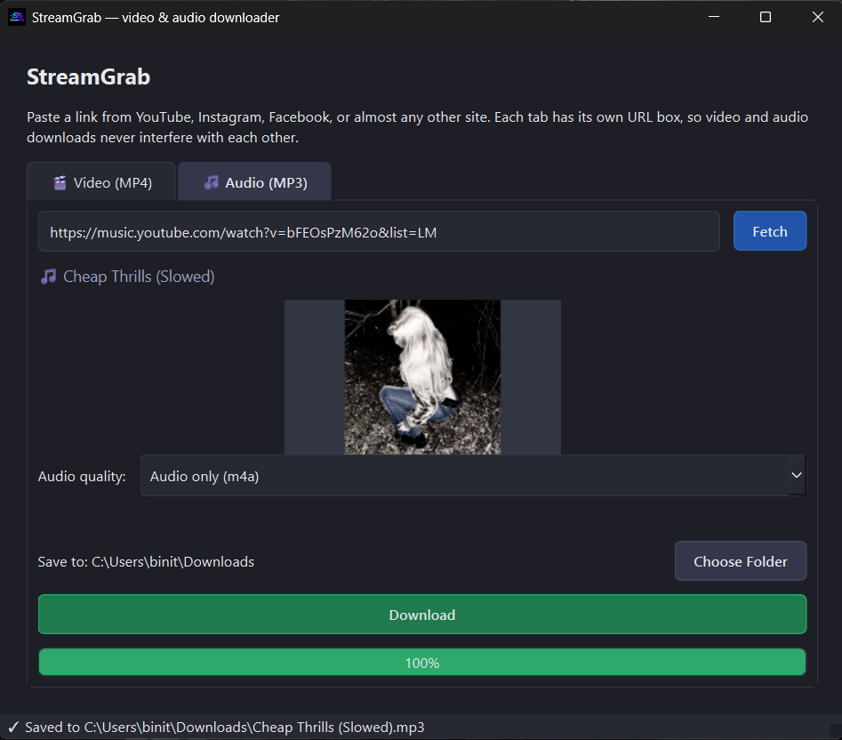

<div align="center">


# StreamGrab

**A modern desktop video & audio downloader powered by yt-dlp**

YouTube, Instagram, Facebook, and 1000+ more sites — in one clean PyQt6 app.

[](LICENSE)
[](https://www.python.org/)
[](https://pypi.org/project/PyQt6/)

</div>

---

## Install

```bash
pip install streamgrab
```

## Run

```bash
streamgrab
```

Then paste a URL into the **Video** or **Audio** tab, click **Fetch**, pick a quality, choose a save folder, and click **Download**.

## StreamGrab UI


## Features

- **Two fully independent tabs** — 🎬 Video (MP4) and 🎵 Audio (MP3) — each with its own URL box, Fetch button, and quality selector. Pasting a URL in one tab never affects the other.
- **Live progress bar** updates in real time during download so you always know how far along it is.
- **Automatic ffmpeg bundling** — no separate download or PATH setup needed. StreamGrab depends on `imageio-ffmpeg`, which ships a real ffmpeg binary for Windows, macOS, and Linux. If you already have a system-wide ffmpeg on your PATH, that one takes priority; the bundled copy is only a fallback.
- **Playlist / mix safety** — a single-video URL never accidentally triggers a slow whole-playlist fetch. StreamGrab forces single-item mode and normalises yt-dlp responses so only the one video you asked for is fetched.
- **Hard 45-second fetch timeout** — a stuck yt-dlp extractor can no longer freeze the UI indefinitely. If metadata takes too long, you get a clear error message instead of an endless "Fetching…" spinner.
- **1000+ supported sites** via yt-dlp — YouTube, Instagram, Facebook, Twitter/X, Vimeo, SoundCloud, and many more.
- **Dark, modern UI** — clean tab layout, status bar, and per-tab error/progress state that stays local to each tab.

## Important: legal use

`yt-dlp` (the engine StreamGrab is built on) is a legitimate, widely used open-source tool. However, many platforms' Terms of Service restrict or prohibit downloading content except through their own official tools. StreamGrab does not bypass any DRM or paywalled content — it only works on publicly accessible media the same way `yt-dlp` itself does. You are responsible for using this tool in accordance with the Terms of Service of whatever site you use it on and applicable copyright law in your country. This tool is intended for personal use cases such as archiving your own content or content you have the right to download.

## Development

```bash
git clone <this repo>
cd streamgrab
pip install -e .
streamgrab
```

## Building a standalone .exe (Windows)

No Python install needed for the person running the app — just build once and share the resulting `.exe`.

1. Make sure you have Python 3.9+ and this project installed (`pip install -e .`), then from inside the `streamgrab` folder run:

   ```
   build_exe.bat
   ```

2. This installs PyInstaller if needed and builds using `StreamGrab.spec`.
3. When it finishes, your executable is at `dist\StreamGrab.exe`. Copy that single file anywhere — it runs standalone, no terminal, no `pip install` required on the target machine.

> **Note:** PyInstaller builds are platform-specific — build on Windows to get a Windows `.exe`; the same steps on macOS/Linux would produce a Mac/Linux binary instead.

## License

This project is licensed under the [MIT License](LICENSE).

```
MIT License

Copyright (c) 2026 StreamGrab contributors

Permission is hereby granted, free of charge, to any person obtaining a copy
of this software and associated documentation files (the "Software"), to deal
in the Software without restriction, including without limitation the rights
to use, copy, modify, merge, publish, distribute, sublicense, and/or sell
copies of the Software, and to permit persons to whom the Software is
furnished to do so, subject to the following conditions:

The above copyright notice and this permission notice shall be included in all
copies or substantial portions of the Software.

THE SOFTWARE IS PROVIDED "AS IS", WITHOUT WARRANTY OF ANY KIND, EXPRESS OR
IMPLIED, INCLUDING BUT NOT LIMITED TO THE WARRANTIES OF MERCHANTABILITY,
FITNESS FOR A PARTICULAR PURPOSE AND NONINFRINGEMENT. IN NO EVENT SHALL THE
AUTHORS OR COPYRIGHT HOLDERS BE LIABLE FOR ANY CLAIM, DAMAGES OR OTHER
LIABILITY, WHETHER IN AN ACTION OF CONTRACT, TORT OR OTHERWISE, ARISING FROM,
OUT OF OR IN CONNECTION WITH THE SOFTWARE OR THE USE OR OTHER DEALINGS IN THE
SOFTWARE.
```
